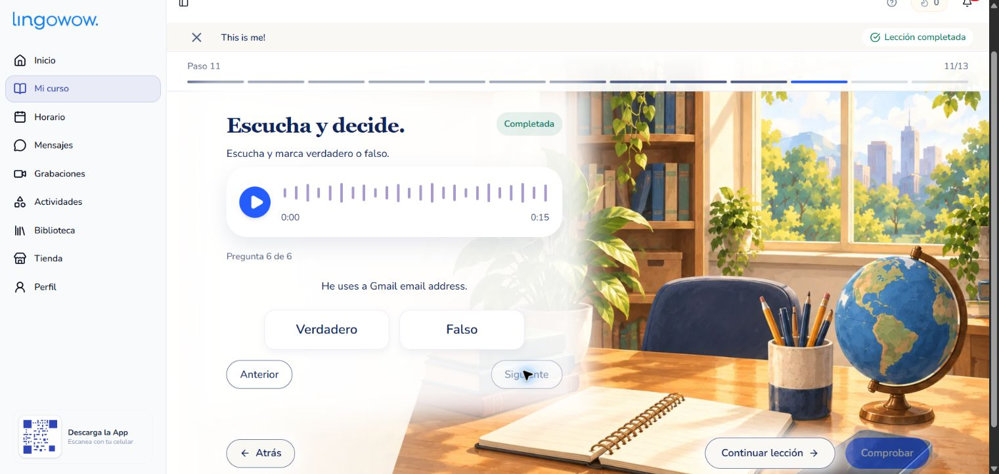

# Unidad 1 — Listening

Audio: Unit_1-2.wav · 15,57 segundos · inglés · nivel A1.

## Para el estudiante

**Escucha y marca verdadero o falso.**

1. He is 20 years old.
2. He is a university student.
3. He works in a bakery.
4. He works in the mornings.
5. He lives with his parents.
6. He uses a Gmail email address.

## Clave docente y evidencia

| # | Respuesta | Evidencia del audio | Corrección si es falsa |
| --- | --- | --- | --- |
| 1 | Falso | I am 19 years old. (0–3.2 s) | He is 19 years old. |
| 2 | Verdadero | I am a university student. (3.6–7.8 s) | — |
| 3 | Verdadero | I work in a bakery. (3.6–7.8 s) | — |
| 4 | Falso | In the afternoons, I work in a bakery. (3.6–7.8 s) | He works in the afternoons. |
| 5 | Falso | I live alone, not with my parents. (8.2–10.3 s) | He lives alone. |
| 6 | Verdadero | My email address is ... at gmail.com. (11–15.3 s) | — |

## Transcripción de referencia

My name is Derek, and I am 19 years old. I am a university student, but in the afternoons, I work in a bakery. I live alone, not with my parents. My email address is [nombre]19@gmail.com.

El nombre propio y el usuario del correo no se deletrean; su ortografía exacta no se evalúa. Los dos modelos coinciden en edad, estudios, trabajo, horario, convivencia y Gmail. La dirección anterior se representa con el usuario omitido para no inventar una grafía.

## Verificación

Transcripción local: Whisper small y Whisper base, con detección de inglés. Audio original conservado sin recodificar. Cada pregunta se apoya en información expresamente pronunciada; ninguna requiere inferir país, ocupación de familiares o datos no presentes. Tres respuestas verdaderas y tres falsas. No se modifica el audio inicial ni sus actividades.

## Publicación y preservación del historial

Publicado únicamente en dev. Se verificó la separación de bases dev/producción y se guardó una copia de los 17 contenidos de la unidad antes de actualizar. Una transacción comparó las cargas anteriores para evitar sobreescribir cambios concurrentes y modificó únicamente el prompt del audio de listening y los seis ítems de verdadero/falso. Las filas Content y sus identificadores se conservan; los tres ítems cuyo significado cambia reciben IDs nuevos. El banco anterior queda archivado en previousListeningItems. No se borran contenidos, progreso ni respuestas.

La simulación con rollback y la publicación comprobaron hashes de todos los contenidos ajenos, progreso y respuestas de la unidad. Todos se conservaron. La revisión pública recorrió las seis afirmaciones sin enviarlas ni calificar; audio original y duración se mantienen.

Pruebas:146 archivos /1066 casos, lint y TypeScript sin errores. Cinco pruebas nuevas cubren hechos y claves, actualización de solo dos cargas, IDs sin reinterpretación, rechazo de fuentes inesperadas e idempotencia. Se observaron fallos con el plan vacío antes de implementarlo. Las pruebas existentes no se modificaron.

Preparación reproducible: `npx tsx scripts/content/prepare-unit1-listening.ts snapshot.json plan.json`. El snapshot debe contener las filas Content de esta lección y el conteo de respuestas del listening. Aplicación: `python scripts/content/apply-unit1-listening.py plan.json` realiza la simulación con rollback; `--apply` confirma la transacción, siempre en la base dev verificada y con los guardas de inventario/historial. No usa los endpoints que reemplazan o eliminan bloques.
