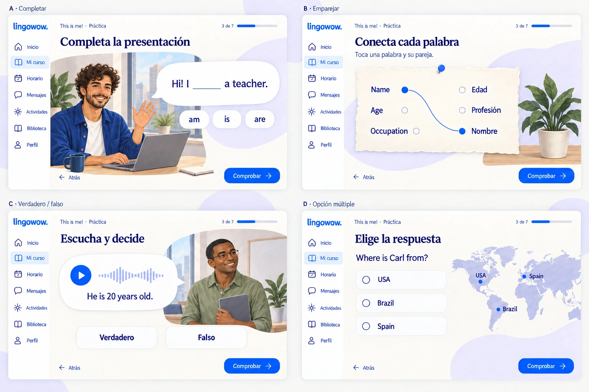
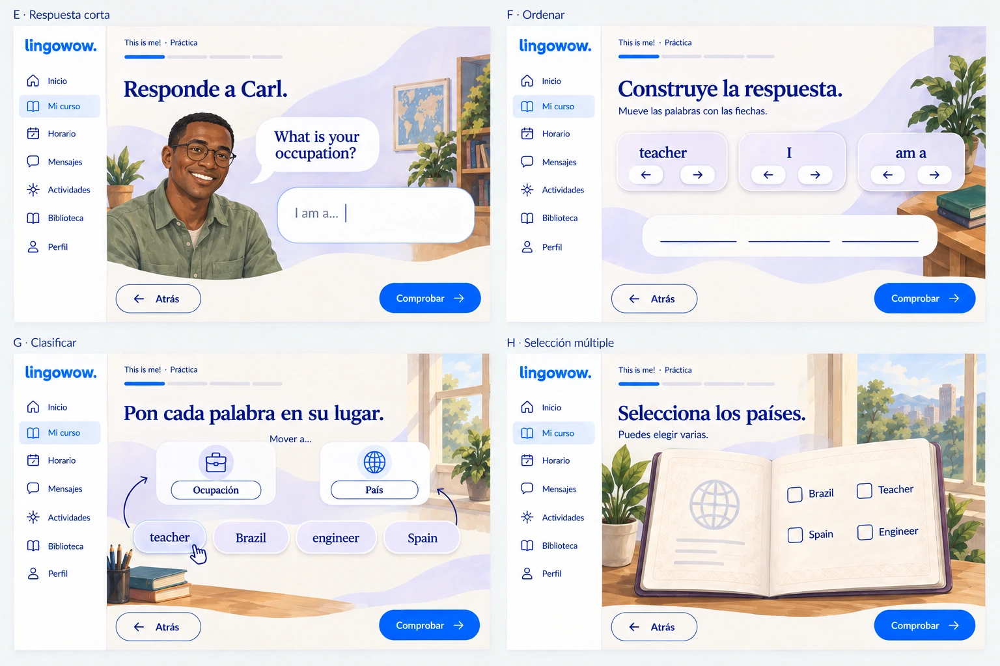
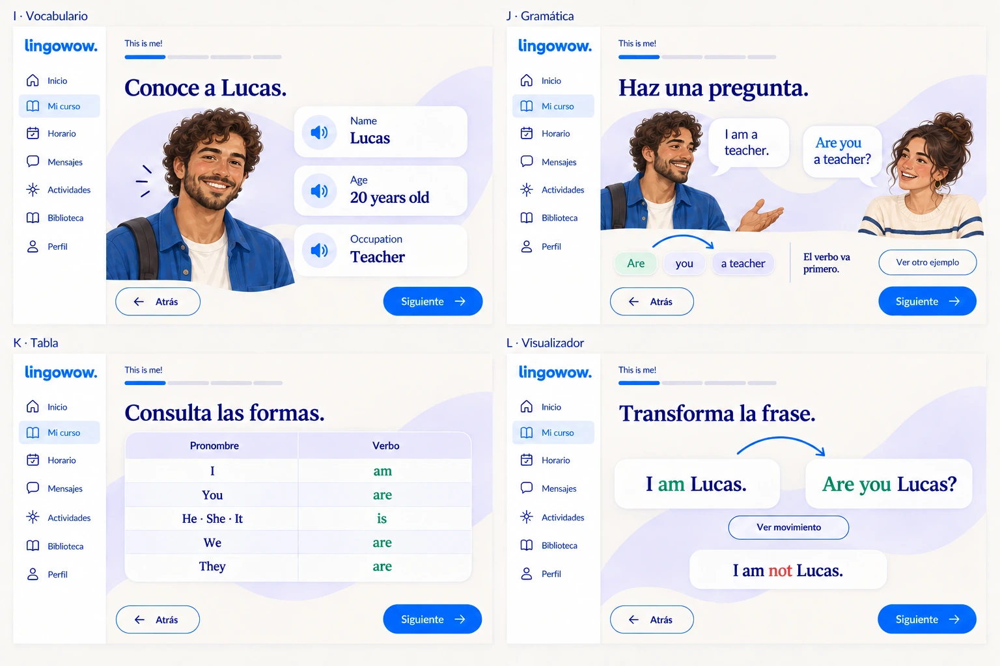
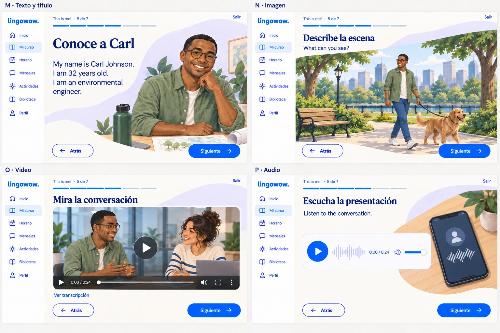
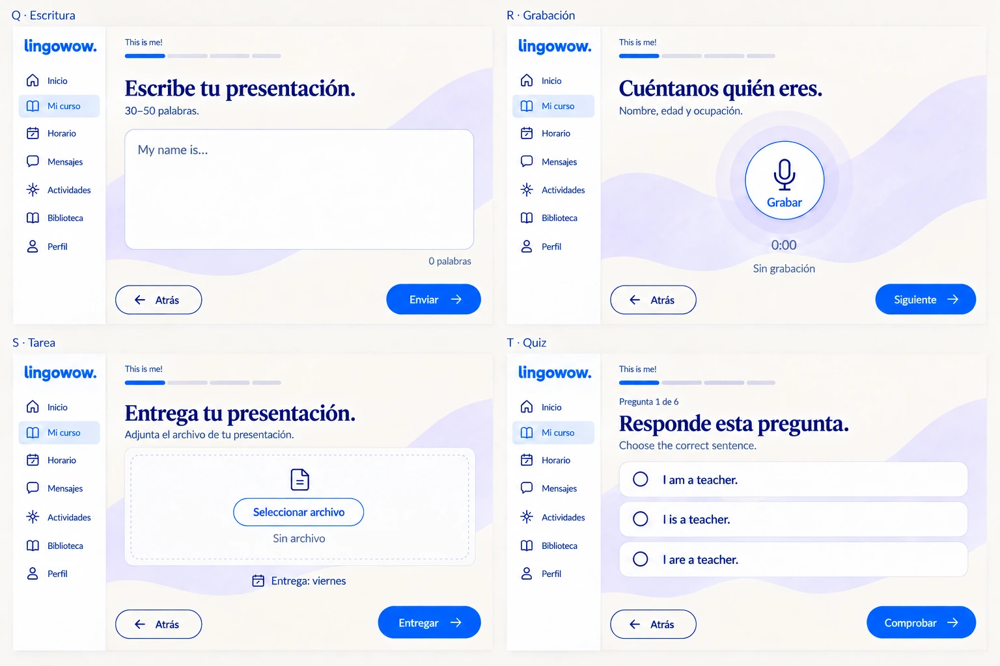
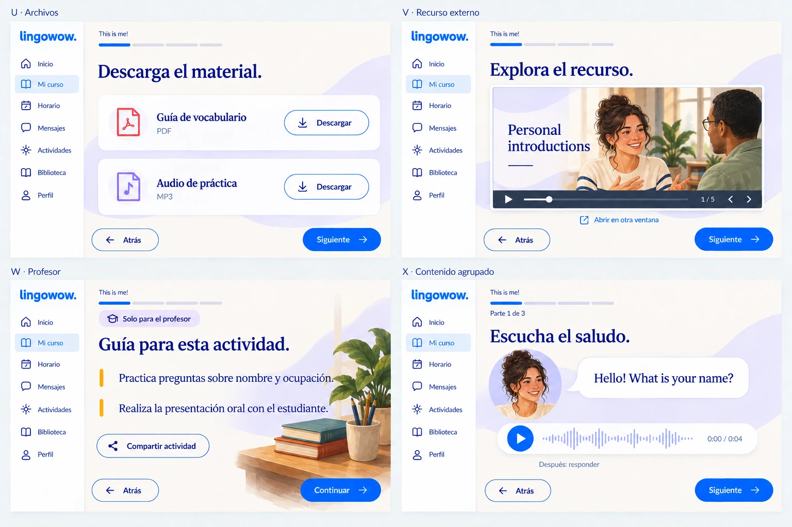

# Mockups v3 · Familia gráfica definitiva

24 vistas en seis láminas, regeneradas con la [guía gráfica v1](../../graphic-guide-v1/README.md).
Todas usan las mismas referencias de personajes, acabado, escenarios y objetos.
La interfaz conserva una instrucción protagonista y una sola acción primaria.

## Referencias que gobiernan esta versión

- [Personajes canónicos](../../graphic-guide-v1/characters.webp): Lucas, Carl y la interlocutora.
- [Escenas, objetos y sistema visual](../../graphic-guide-v1/scenes-ui.webp).
- [Tokens](../../graphic-guide-v1/tokens.json): color, tipografía, espaciado y controles.
- [Prompts exactos de las seis regeneraciones](generation-prompts.json).
- [Dimensiones, codificación y pesos](assets.json).

Las referencias se reutilizaron en las seis llamadas. Se conservaron las identidades:
Lucas rizado y con barba corta, Carl afeitado y con gafas, interlocutora con recogido y
vestuario crema/marino. No se mezclan rostros fotográficos, caricatura plana y pintura editorial.

## Las seis láminas

| Lámina | Vistas | Tipos |
| --- | --- | --- |
| [01 · Práctica básica](01-basic-practice.webp) | A–D: completar, emparejar, verdadero/falso, opción múltiple | `fill_blanks`, `match`, `true_false`, `multiple_choice` |
| [02 · Práctica avanzada](02-advanced-practice.webp) | E–H: respuesta corta, ordenar, clasificar, seleccionar varias | `short_answer`, `ordering`, `drag_drop`, `multi_select` |
| [03 · Lenguaje](03-language.webp) | I–L: vocabulario, gramática, tabla, visualizador | `vocabulary`, `grammar`, `structured-content`, `grammar-visualizer` |
| [04 · Multimedia](04-multimedia.webp) | M–P: lectura, imagen, video, audio | `text`, `title`, `image`, `video`, `audio` |
| [05 · Producción](05-production.webp) | Q–T: escritura, grabación, entrega y quiz | `essay`, `recording`, `assignment`, `quiz` |
| [06 · Recursos y estructura](06-resources-structure.webp) | U–X: archivos, embed, notas docentes y partes agrupadas | `file`, `embed`, `teacher_notes`, `tab_group`, `tab_item`, `layout`, `column`, `container`, `block_group` |

### Ejercicios y lenguaje

### Medios, producción y recursos

## Criterios aplicados

- Un título de tarea; la unidad queda como contexto discreto.
- Solo «Comprobar» en el estado inicial del ejercicio; «Siguiente» lo sustituye
  en la misma posición cuando lo permitan las reglas configuradas.
- Acciones secundarias sin competir con el botón principal.
- Ordenar: flechas izquierda/derecha, coherentes con la fila horizontal.
- Clasificar: las dos categorías tienen una acción equivalente; el arrastre es opcional.
- Personajes únicamente en contextos de diálogo, presentación o contenido.
- Texto de lectura, ejemplos y opciones legibles, sin escritura decorativa en objetos.
- Notas del profesor fuera del recorrido del estudiante.
- Contenido obligatorio agrupado como partes secuenciales, sin temas ocultos en pestañas.

## Entrega y límites de la maqueta

Cada lámina tiene 1536 × 1024 px y formato WebP, calidad 92. Las seis suman
1.125.136 bytes (aproximadamente 1,13 MB). Los originales PNG generados se conservan.
Las placas canónicas se entregan como WebP de calidad 94.

Los ejemplos, personajes, preguntas, plazos y contadores de estas vistas son muestras
para revisar el diseño. Al implementarlo se conserva el contenido publicado y su configuración.
Las imágenes son propuestas estáticas: no certifican foco, teclado, estados de carga,
contraste real de la implementación ni funcionamiento de las acciones.

En esta versión, las miniaturas de video y recursos externos también son ilustradas
para demostrar una sola familia visual. **No implica repintar o sustituir videos reales**
del curso: el material didáctico auténtico mantiene su formato. Los colores y fuentes
exactos de la implementación deben proceder de los tokens y la guía, no de muestrear el raster.

Esta entrega solo añade documentación y mockups. No cambia el visor, las reglas de
evaluación, las respuestas, los tests ni el contenido de la base de datos.
Las versiones [v1](../README.md) y [v2](../v2/README.md) se conservan para comparación.
