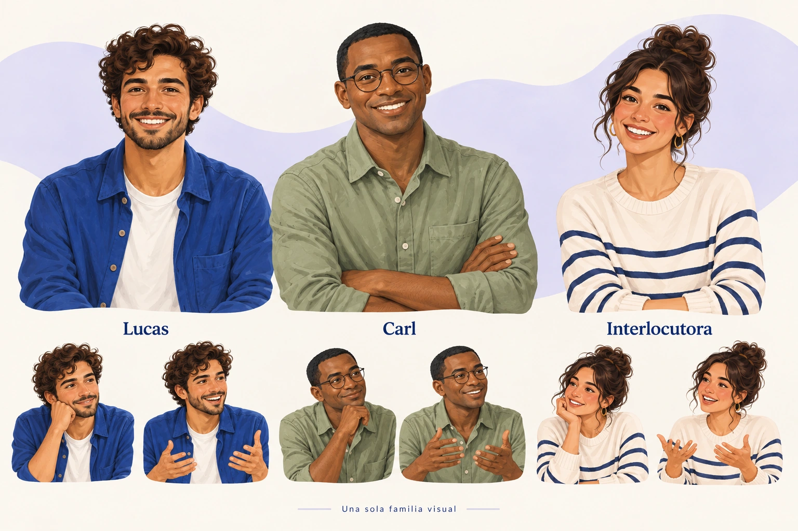
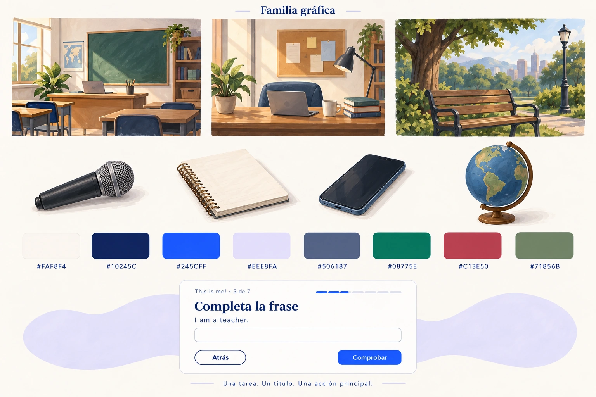

# Guía gráfica definitiva · v1.0

**Estado:** normativa para la regeneración de las 24 propuestas visuales y para la posterior implementación de la experiencia de lecciones. **Ámbito:** dirección de arte, composición, copy y entrega de medios. No sustituye la configuración del contenido ni las reglas de evaluación del producto.

Esta guía es la fuente de decisión visual para las placas de estilo y los seis tableros v3. El catálogo v3 estará en
[../content-format-mockups/v3/README.md](../content-format-mockups/v3/README.md).
Las referencias aprobadas de personajes y escenas son
[characters.webp](characters.webp) y [scenes-ui.webp](scenes-ui.webp).
Si una placa o un mockup contradice este documento, se corrige la placa o el mockup; el contenido publicado y su configuración siguen siendo la autoridad pedagógica.

## 1. Decisiones que no se negocian

- La imagen aprobada es un punto medio **painterly editorial adulto y semirrealista**: proporciones naturales, rasgos suavizados, textura de pincel sutil y luz mate.
- Quedan fuera el fotorrealismo con poros visibles, el render 3D, el anime, el acabado infantil o de caricatura plana, el plástico brillante y cualquier deriva hacia una estética fotográfica o de videojuego.
- Cada pantalla tiene una tarea reconocible. Hay una mini-miga de unidad, un solo encabezado de tarea y un prompt en cuerpo de texto; el prompt no se convierte en un segundo encabezado.
- El pie tiene una sola acción primaria cobalto que evoluciona de **Comprobar** a **Siguiente** después de verificar la respuesta. Nunca se muestran las dos a la vez y no se inventan bloqueos, intentos, aprobaciones o pasos que no estén en la configuración.
- Mover y clasificar son acciones secundarias con apariencia outline. La acción de arrastrar siempre tiene una alternativa de selección y teclado.
- El texto, los controles, el foco y los estados son elementos reales de interfaz. Una ilustración no reemplaza una pregunta, una etiqueta, un reproductor ni un botón.
- Las ilustraciones son decorativas salvo que la imagen enseñe algo necesario para responder. El alt se deriva de ese contenido real; no se usa una etiqueta fija como «Lucas» o «Carl» para toda imagen del personaje.

## 2. Lenguaje visual aprobado

### Marca y navegación

Usar el logotipo existente de `public/branding/Lingowow - Logo azul sin fondo.png`
o su variante de marca aprobada. No redibujarlo, reinterpretar su tipografía ni
añadir un símbolo nuevo. La paleta de la unidad no autoriza recolorear el logotipo.
Mantener nombres y destinos de la navegación existente; en móvil, conservar el
acceso reconocible a la navegación sin ocupar la zona de respuesta.

### Estilo de imagen

Usar fondos marfil con formas orgánicas lilas, masas de color suaves, bordes ligeramente irregulares y textura de pincel controlada. Mantener una iluminación mate y una profundidad corta, suficiente para separar planos sin simular una foto. Las manos, objetos y rostros deben conservar proporciones humanas naturales. El acabado editorial debe sentirse adulto, cálido y didáctico, sin ternurizar al estudiante ni convertir la interfaz en una escena infantil.

No introducir grano fotográfico, poros de piel, reflejos especulares, volumen 3D, perspectiva extrema, ojos de anime, cabezas sobredimensionadas, contornos negros de caricatura plana, texto ilegible generado, logos inventados o elementos de UI dentro de un raster. Una pizarra, taza o libro de fondo no debe llevar escritura decorativa. Si una imagen contiene una palabra por razones pedagógicas, esa palabra debe estar también en el contenido accesible real.

### Personajes y continuidad

| Identidad | Descripción que se debe conservar | Uso autorizado |
| --- | --- | --- |
| **Lucas** | Piel canela cálida; cabello castaño oscuro, rizado y despeinado; barba corta; sobrecamisa cobalto; camiseta blanca. | Contexto de vocabulario, conversación y presentación. No cambiar el color de la camisa, la barba, el cabello ni el tono de piel entre vistas. |
| **Carl** | Piel marrón oscura; cabello negro corto y muy recortado; rostro completamente afeitado; gafas redondas; camisa salvia. | Lectura, conversación y contexto ambiental. No añadir barba ni mezclarlo con los rasgos de Lucas. |
| **Interlocutora** | Usar únicamente la identidad de la maqueta original aprobada: piel media cálida, cabello castaño oscuro recogido de forma suelta, blusa crema con rayas marino. | Diálogo cuando el contenido real la requiera. No crearle nombre, biografía, rasgos o vestuario nuevos. |

Las personas sin nombre no reciben una identidad nueva solo para llenar una escena. Si el contenido no necesita un personaje, usar objetos o una escena vacía. Mantener la misma silueta, escala, vestuario, paleta de piel y tratamiento de pincel en todas las apariciones. No convertir un busto editorial en un avatar 3D, una foto ni un personaje infantil.

### Objetos y escenas

La familia de objetos y escenas comparte el mismo tratamiento painterly, mate y semirrealista. Un micrófono, auriculares, cuaderno, taza, lámpara salvia, planta, mapa o plano ambiental sirven para explicar la tarea o dar escala; no se añaden porque sí. Un objeto que aparece en una placa debe conservar su color, material y proporción al reaparecer.

La escena puede usar una mesa de café, una oficina sobria o un paisaje de trabajo cuando el texto lo justifique. El fondo no debe competir con la instrucción, formar una rejilla de tarjetas ni introducir marcas o texto inventado. La ilustración no debe derivar hacia un realismo distinto del personaje que la acompaña.

## 3. Tokens de la guía

Los valores reutilizables están también en [tokens.json](tokens.json).

Los siguientes valores son la paleta de dirección de arte. Son tokens de intención, no una autorización para combinar cualquier color con cualquier fondo. La persona que implemente debe conservar las relaciones de rol y usar los valores accesibles aprobados por la revisión de contraste.

### Color

| Token | Valor de referencia | Rol normativo |
| --- | --- | --- |
| ivory | #FAF8F4 | Superficie principal y fondo de lectura. |
| navy | #10245C | Encabezados, texto fuerte y navegación. |
| cobalt | #245CFF | Único relleno de acción primaria en el pie. |
| lilac | #EEE8FA | Superficie secundaria y formas orgánicas decorativas. |
| green | #08775E | Estado positivo y texto de éxito cuando la pareja esté aprobada. |
| coral | #DC5968 | Acento de ilustración no textual. No usar como texto, enlace o mensaje de error. |
| slate | #506187 | Texto secundario, metadatos y bordes con contraste aprobado. |
| sage | #71856B | Decoración de ilustración. No usar como texto de interfaz. |
| error-text | #C13E50 | Texto de error legible, acompañado de una explicación. |
| negation-text | #C13E50 | Alias del coral oscuro para la palabra de negación en gramática; no indica que la respuesta sea incorrecta. |

La aprobación de contraste de esta versión se calculó con el método WCAG. La referencia para contraste mínimo es [WCAG 2.2 · Contrast (Minimum)](https://www.w3.org/WAI/WCAG22/Understanding/contrast-minimum.html). Los ratios se muestran redondeados para lectura; la revisión debe comparar los valores sin redondear. Estas parejas son las únicas referencias de texto/controles aprobadas hasta que la revisión principal publique una actualización; por sí solas no certifican toda la interfaz:

| Pareja | Ratio | Uso aprobado |
| --- | ---: | --- |
| navy sobre ivory | **13.86:1** | Texto principal, encabezados y navegación. |
| slate sobre ivory | **5.82:1** | Texto secundario legible a partir de 16 px y metadatos con tamaño suficiente. |
| Blanco #FFFFFF sobre cobalt | **5.19:1** | Texto de la acción primaria. |
| green sobre ivory | **5.20:1** | Texto de estado positivo. |
| coral sobre ivory | **3.49:1** | Solo decoración no textual; no usar en texto ni iconos informativos. |
| sage sobre ivory | **3.76:1** | Solo decoración de ilustración. |
| C13E50 sobre ivory | **4.86:1** | Texto de error legible; el color de texto de error aprobado es #C13E50, no coral. |
| slate sobre lilac | **5.16:1** | Texto sobre superficie secundaria. |

No asumir que un color es accesible porque pertenece a la paleta. En cada estado se revisan texto normal, texto grande, icono que comunica estado, borde de control e indicador de foco. Si el cálculo de implementación exige un ajuste, se aprueba el valor accesible para ese rol antes de publicar; no se baja la opacidad del texto para hacer que una pareja «se vea más suave».

### Tipografía

- **Cuerpo:** Nunito, la fuente de marca que el repositorio carga desde src/app/layout.tsx mediante next/font/google. Verificar el loader/archivo efectivo antes de cerrar la implementación; no instalar una fuente solo para esta guía.
- **Monoespaciada:** Geist Mono solo para valores técnicos o código cuando sea necesario; no usarla como cuerpo editorial.
- **Encabezados:** Georgia, serif como fallback común. No descargar ni instalar una fuente adicional para obtener esta jerarquía.
- **Cuerpo mínimo:** 16 px, con interlineado cómodo (24 px como referencia).
- **Encabezado de tarea:** 32 px en escritorio y 26 px en móvil; mantener una sola línea jerárquica protagonista siempre que el idioma lo permita.
- **Miga de unidad:** 14 px y secundaria; nunca se convierte en un título grande repetido.
- **Etiquetas y ayuda:** 14–16 px según longitud y contraste; no usar 12 px para instrucciones.
- **Controles:** mínimo 44 × 44 px; la acción primaria del pie usa 48 px de alto como decisión de producto.
- Los botones, entradas y etiquetas se escriben en frase normal, con verbos concretos. Evitar mayúsculas sostenidas para simular jerarquía.

### Espaciado, máscaras y forma

Usar únicamente la escala **8 / 16 / 24 / 32 / 48 px** para márgenes, rellenos y separación. Elegir el paso más pequeño que mantenga el grupo reconocible; no crear valores ad hoc para cada mockup.

Los radios de referencia son 8 px para elementos pequeños, 16 px para campos,
24 px para medios y 999 px para botones de pie. Las máscaras orgánicas se reservan
para arte y se reutilizan; no se inventa una forma diferente en cada pantalla.
El foco usa un anillo marino de 2 px, separado del control por 2 px de superficie clara,
para que también sea reconocible sobre un botón cobalto.

| Elemento | Regla de forma |
| --- | --- |
| Superficie de contenido | Máscara rectangular de esquinas suaves; no usar un contorno orgánico detrás de texto largo. |
| Medio o retrato | Máscara suave consistente con la placa; usar contain cuando el cuerpo o la cara sean parte del contenido y nunca recortar una cara por llenar un marco. |
| Forma orgánica | Solo fondo o decoración sin interacción; no puede ocultar foco, texto o una zona de respuesta. |
| Estado o etiqueta corta | Píldora solo cuando el elemento sea realmente un estado; no convertir toda acción en una píldora. |
| Control | La máscara no debe reducir el área pulsable: controles de al menos 44 × 44 px. Es una decisión de producto más amplia que el mínimo AA de 24 × 24 CSS px, con sus excepciones, descrito en [WCAG 2.2 · Target Size (Minimum)](https://www.w3.org/WAI/WCAG22/Understanding/target-size-minimum.html). |

### Iconos

Usar iconos lineales del sistema existente, con trazo y escala constantes (20–24 px como referencia). Un icono que comunica una acción debe llevar una etiqueta visible o nombre accesible; no usar un símbolo aislado para «mover», «grabar» o «comprobar». Las flechas de orden horizontal son **izquierda** y **derecha**. Las flechas arriba/abajo no representan el orden de la fila y no deben aparecer en ese ejercicio. El icono no aporta color semántico por sí solo: el estado también se expresa con texto, forma o posición.

## 4. Composición de la pantalla

La secuencia visual estable es:

1. miga pequeña de unidad y progreso, si existe en la configuración;
2. un único encabezado de tarea;
3. prompt en cuerpo de texto y contenido necesario para resolverlo;
4. respuesta, medio o interacción;
5. explicación breve o feedback junto a la respuesta, cuando corresponda;
6. pie con una sola acción primaria.

La unidad no vuelve a aparecer como un título enorme. «Completa la presentación» puede ser el único encabezado de tarea; la frase «I ___ a teacher» es contenido en el cuerpo, no un segundo encabezado. El pie debe permanecer a la vista después de la interacción sin saltos de layout. Si la pantalla es muy corta, se permite desplazamiento; no se comprime texto por debajo de 16 px.

La acción de pie es cobalto con texto blanco y estados claros. Antes de verificar muestra **Comprobar**. Después de la respuesta válida, el mismo control puede mostrar **Siguiente**. Si la configuración no requiere comprobación, el texto de la acción debe corresponder al flujo real. Nunca inventar un gate de «aprobar» o «desbloquear» solo porque una maqueta tiene un botón.

Las acciones de mover, clasificar, quitar y seleccionar destino son outline. En ordering, una fila horizontal se reordena con botones izquierda/derecha y con teclado; arrastrar es opcional. En drag_drop, la persona puede seleccionar una palabra, seleccionar **cualquier** categoría disponible y activar «Mover a …» con clic o teclado; arrastrar es un atajo, nunca el único camino.

### Estados de controles

| Estado | Tratamiento y requisito |
| --- | --- |
| Reposo | Superficie y borde aprobados; la etiqueta explica la acción. |
| Hover | Cambio breve de superficie o borde, sin desplazar contenido ni depender solo del color. |
| Foco visible | Anillo de foco claramente visible con una pareja de contraste aprobada y sin quedar oculto por una máscara. |
| Pulsado/seleccionado | Estado persistente visible por borde, fondo o marca además del color. |
| Deshabilitado | Solo cuando la configuración o el estado lo exige; conservar etiqueta y motivo accesibles. No usar para inventar una puerta de progreso. |
| Comprobado correcto | Feedback cercano, breve y textual; puede cambiar la acción a **Siguiente**. El éxito no debe mover el pie. |
| Feedback neutral | Explica qué revisar sin llamar a la respuesta «incorrecta» ni afirmar una condición de aprobación no configurada. |
| Error | Texto legible #C13E50 sobre la superficie aprobada, descripción asociada al campo y solución concreta. |
| Cargando/grabando | Estado anunciado, control reconocible y acción que no se puede ejecutar mientras la operación está en curso. |

No mezclar el feedback con una nueva pantalla modal si una línea junto a la respuesta lo explica. No retirar una respuesta ni limpiar el campo para mostrar un resultado. No presentar «Comprobar» y «Siguiente» como dos acciones primarias en el mismo pie.

## 5. Responsive, accesibilidad y movimiento

- En móvil se conserva el orden de lectura: miga, encabezado, prompt, contenido, respuesta, feedback y pie. Las columnas se apilan; no se reduce la letra para hacer caber dos columnas.
- El pie puede ocupar todo el ancho disponible en móvil, con un área mínima de 44 × 44 px y separación suficiente de la barra del sistema. Mantener una sola acción cobalto.
- Todas las interacciones tienen teclado: foco lógico, Enter/Space para seleccionar, flechas izquierda/derecha para ordenar y una alternativa explícita al arrastre. El foco no se comunica solo con color.
- Los inputs tienen etiqueta asociada y el feedback anuncia el campo afectado. Audio y video ofrecen controles reales, subtítulos o transcripción cuando el material lo requiere y un enlace alternativo si el embed falla.
- Las imágenes decorativas tienen alt vacío. Las imágenes pedagógicas describen el dato necesario para responder, no el nombre de la persona que aparece.
- Las notas del profesor no aparecen en el recorrido del estudiante. Un contenido obligatorio en pestaña se convierte en un paso secuencial; no se esconde como tema que el estudiante podría omitir.
- Con prefers-reduced-motion, quitar desplazamientos, rebotes, zoom de imagen y transiciones largas. Conservar el cambio de estado y el feedback en forma inmediata. Nunca usar animación para comunicar que una respuesta es correcta.
- Como decisiones de producto, usar 160 ms para cambios de estado y hasta 240 ms
  para una transformación gramatical explicativa. Sin movimiento reducido se permite
  una transición suave; con esa preferencia, la duración es cero. No bloquear una acción
  esperando la animación ni reproducir audio automáticamente al cambiar de paso.
- No usar sonido, vibración, parpadeo ni temporizadores visuales como única señal. El contador de grabación se acompaña de texto y estado accesible.

## 6. Cobertura de los 30 tipos declarados

El editor declara 30 BlockType: 23 plantillas de contenido y siete tipos estructurales o de compatibilidad. Los 24 mockups muestran una vista por tarea; una vista puede reunir dos tipos semánticamente inseparables (por ejemplo, title con text) y la vista estructural puede documentar varios hijos. La lista completa sigue siendo obligatoria.

### 23 plantillas de contenido

| Tipo | Tratamiento visual y editorial | Regla de interacción o datos |
| --- | --- | --- |
| title | Es el único encabezado de tarea de la pantalla; breve y específico. | No repetir el nombre de unidad como otro título. |
| text | Cuerpo de lectura en párrafos cortos, listas o énfasis semántico. | El texto explica o prepara; no convertirse en un segundo encabezado ni en slogan. |
| image | Imagen de contenido con máscara estable, pie solo si aporta información. | alt describe el contenido útil; no forzar recorte de cara ni usar raster como UI. |
| video | Reproductor sobrio con miniatura y título real del material. | Usar media real autorizada con propósito pedagógico, controles, subtítulos/transcripción y alternativa si falla. |
| audio | Reproductor y forma de onda discretos; título y duración cuando existan. | Respetar maxReplays si está configurado; no inventar un límite. Incluir transcripción cuando sea necesaria. |
| quiz | Una pregunta por vista en el recorrido, con contexto y opciones legibles. | Conservar preguntas, puntaje y regla de paso configurados; no afirmar aprobado por defecto. |
| file | Lista de descargas con nombre, tipo, tamaño y acción accesible. | La descarga debe tener texto y estado; no ocultar el enlace detrás de un icono. |
| embed | Marco de recurso externo con título y contexto. | Mostrar enlace alternativo y mensaje comprensible si el recurso no carga. |
| grammar | Regla breve, ejemplo y aplicación en una misma secuencia. | La regla no se vuelve una pantalla decorativa; respetar la explicación publicada. |
| vocabulary | Término, definición, pronunciación y ejemplo contextualizados. | Un personaje puede dar contexto, pero no se inventan identidades ni definiciones. |
| fill_blanks | Frase completa y espacios claramente editables; no usar subrayado como única señal. | Etiquetas, teclado, formato y feedback deben seguir el dato configurado. |
| match | Dos conjuntos de opciones seleccionables con pares visibles. | Emparejar por clic/teclado; arrastrar puede existir como atajo, nunca como requisito. |
| true_false | Una afirmación por vez y dos opciones equivalentes. | No revelar la respuesta mediante color, orden o iconografía antes de verificar. |
| essay | Prompt protagonista y área de escritura con ayuda de longitud si está configurada. | Respetar min/max reales y evaluación publicada; no crear un máximo solo por el mockup. |
| recording | Micrófono, duración y estados de permiso, grabando, detenido y enviado. | No permitir avanzar mientras se captura audio; mostrar alternativa si el permiso falla y respetar el límite configurado. |
| structured-content | Tabla, lista o estructura de datos con agrupación legible y apilado móvil. | Encabezados de tabla y relaciones se conservan en móvil; el layout no añade una actividad. |
| grammar-visualizer | Transformación visual de tokens y ejemplos con énfasis moderado. | El orden y el significado deben poder leerse sin animación; estados accesibles para cada transformación. |
| multiple_choice | Una pregunta contextual y opciones tipo radio con área amplia. | Una sola elección salvo que la configuración indique otra cosa; no usar color para señalar la correcta. |
| short_answer | Campo de respuesta corta con ejemplo o formato esperado en ayuda. | Etiqueta, longitud y validación derivadas de la configuración; no autoevaluar sin regla real. |
| ordering | Fila o lista ordenable con jerarquía clara. | En una fila horizontal, usar flechas **izquierda/derecha** y teclado; el drag es opcional. |
| drag_drop | Elementos seleccionables y destinos nombrados, sin depender del gesto. | Elegir cualquier categoría por clic o teclado y activar una acción de mover; arrastre opcional. |
| multi_select | Lista de casillas con resumen de selecciones. | Permitir seleccionar varias opciones; el estado seleccionado se ve sin depender solo del color. |
| teacher_notes | Panel distinto para la vista de docente, con etiqueta «Notas del profesor». | Solo docente; jamás forma parte de la secuencia del estudiante ni oculta contenido obligatorio. |

### Siete tipos estructurales o de compatibilidad

| Tipo | Tratamiento normativo |
| --- | --- |
| tab_group | Agrupa contenido relacionado. Las pestañas son adecuadas para exploración; si el contenido es obligatorio, convertirlo en pasos secuenciales visibles. |
| tab_item | Hijo de tab_group; hereda su jerarquía y no crea un segundo encabezado de tarea. Cada paso conserva nombre, foco y orden accesible. |
| layout | Contenedor de composición. No crea una pregunta, un punto ni una acción adicional. |
| column | Columna de layout; se apila en móvil y conserva el orden de lectura. No usarla para esconder una respuesta. |
| container | Agrupación genérica declarada para compatibilidad. No presentarla como actividad independiente si no tiene visor/editor específico. |
| block_group | Grupo semántico de bloques. Puede compartir contexto visual, pero no añade un título de tarea ni un gate. |
| assignment | Tarea de compatibilidad: instrucción, estado de entrega y únicamente la modalidad configurada (texto, archivo o enlace). Nombre de archivo/enlace, plazo y límites se muestran solo si existen; la acción es «Entregar». No inventar un selector de modalidad ni una fecha. |

assignment pertenece a la familia de compatibilidad para el inventario de 30. El recuento es: 23 plantillas declaradas por el editor + 7 tipos estructurales/compatibilidad = 30.

### Mapa de las 24 vistas v3

| Tablero | Cuatro vistas de revisión | Tipos cubiertos |
| --- | --- | --- |
| 01 · Práctica básica | Completar, emparejar, decidir verdadero/falso, opción múltiple | fill_blanks, match, true_false, multiple_choice |
| 02 · Práctica avanzada | Respuesta corta, ordenar, clasificar, selección múltiple | short_answer, ordering, drag_drop, multi_select |
| 03 · Lenguaje | Vocabulario, regla gramatical, contenido estructurado, visualizador | vocabulary, grammar, structured-content, grammar-visualizer |
| 04 · Multimedia | Texto con su título, imagen significativa, video de conversación, audio | text, title, image, video, audio |
| 05 · Producción | Ensayo, grabación, tarea configurada, quiz | essay, recording, assignment, quiz |
| 06 · Recursos y estructura | Descargas, recurso externo, notas docentes, recorrido agrupado | file, embed, teacher_notes, tab_group, tab_item, layout, column, container, block_group |

Los rótulos de catálogo A–X, si se necesitan para revisión, viven en el margen del tablero y no en el contenido de la unidad. Las seis láminas deben mostrar el mismo sistema de miga, encabezado, prompt y pie; el tipo cambia la tarea, no la jerarquía.

## 7. Escritura editorial

Escribir en español claro, directo y adulto. Un prompt contiene un verbo y un resultado observable: «Ordena la frase», «Escucha y decide» o «Elige las opciones que describen la rutina». Dar contexto solo si ayuda a responder. Quitar slogans, texto de relleno y nombres de secciones que no correspondan al tipo real de bloque.

Conservar nombres, cantidades, URLs de audio, instrucciones y reglas publicados; una cifra del mockup es una muestra visual y no modifica el contenido. No convertir una nota del profesor en ayuda del estudiante ni presentar una explicación visual como evaluación.

El feedback debe describir el siguiente paso: «Revisa el auxiliar» o «Escucha de nuevo y elige una opción». El feedback neutral no inventa un gate, una aprobación, un número de intentos ni una puntuación. La etiqueta de **Siguiente** solo aparece cuando el flujo real permite avanzar.

## 8. Entrega de medios

- Entregar imágenes runtime en **WebP**, con un máximo de **1200 px en su lado mayor**. No ampliar una fuente pequeña.
- Un retrato o escena con contenido relevante es contentful: conservar el cuerpo y el encuadre necesario, sin recortar una cara para llenar un contenedor.
- Entregar cada tablero de diseño a **1536 px de ancho**, WebP con calidad **92**. Las placas son referencias de revisión, no imágenes que sustituyan elementos DOM.
- Conservar los originales raster en el almacenamiento de producción correspondiente junto a su nombre de fuente y fecha; no borrar originales después de exportar.
- Nombrar de forma estable: character-or-scene-purpose-vN.ext, sin espacios ni nombres ambiguos. Registrar para cada recurso propósito, fuente, dimensiones, estado de licencia y texto alternativo.
- Fotos y videos solo pueden ser media real autorizada con propósito pedagógico. No usar fotos o videos generados para simular la UI o decorar un bloque que no los necesita.
- No incrustar texto, controles, botones o feedback dentro de una imagen runtime. En la implementación, conservar el uso existente de next/image con fill y sizes; esta guía no autoriza cambiar ese código por motivos de composición.

## 9. Receta de generación y revisión

Los prompts exactos de las dos placas se conservan en [generation-prompts.json](generation-prompts.json).

### Prompt base

Esta receta produce **ilustraciones runtime sin texto**. Para regenerar un mockup,
se conserva la interfaz y se cambia solo la dirección de arte según las dos placas;
los prompts completos de mockups se guardan en su catálogo v3. Un mockup puede mostrar
texto de interfaz para revisión, pero no se exporta como sustituto de la interfaz real.

Comenzar cada prompt de imagen con este bloqueo de estilo:

> Ilustración editorial educativa adulta, semirrealista painterly, proporciones naturales, rasgos suavizados, textura de pincel sutil, iluminación mate, fondo marfil con acentos lilas orgánicos, paleta Lingowow sobria, sin texto ni interfaz.

Después añadir, en este orden:

1. intención pedagógica y tipo de bloque;
2. personaje o ausencia de personaje, usando la ficha exacta de Lucas, Carl o la interlocutora aprobada;
3. objeto y escena necesarios, con la misma familia painterly;
4. encuadre y espacio vacío reservado al texto real de la interfaz;
5. salida, relación de aspecto, resolución y nombre de recurso.

Cerrar con una exclusión explícita: no photopores, no photorealism, no 3D, no anime, no childish flat cartoon, no plastic gloss, no invented logos, no UI text, no extra characters, no identity drift. Para Carl añadir clean-shaven, round glasses; para Lucas short beard, cobalt overshirt, white tee; para la interlocutora approved original identity only.

### Secuencia de producción

Para los mockups v3 se usaron siempre tres entradas: composición anterior, lámina
canónica de personajes y lámina canónica de escenas/objetos. Las dos referencias
canónicas tienen prioridad sobre los rostros o acabados de la composición anterior.
Para nueva ilustración runtime, leer también la ficha del personaje y adjuntar la
referencia canónica; describir una pose no autoriza modificar su identidad.

1. Leer el tipo, el contenido real y su configuración antes de escribir el prompt.
2. Elegir la referencia de personaje/escena y fijar continuidad en una hoja de control; no crear una identidad nueva para resolver una composición.
3. Generar variantes que dejen una zona despejada para texto y controles reales.
4. Comparar cara, cabello, vestuario, piel, objeto, luz y textura con las placas aprobadas.
5. Seleccionar una variante sin texto generado ni recortes de rostro, conservar el original y exportar el WebP de entrega.
6. Colocar la imagen solo como apoyo del bloque. La maqueta debe dejar visibles la miga pequeña, un encabezado, el prompt, la respuesta y el pie de una acción.
7. Revisar el tablero completo a 1536 px y a un tamaño móvil antes de marcarlo aprobado.

## 10. Lista de QA antes de aprobar

### Contenido y producto

- [ ] El inventario contiene exactamente los 30 nombres declarados y distingue las 23 plantillas de los siete tipos estructurales/compatibilidad.
- [ ] Las 24 vistas están presentes en seis tableros de cuatro vistas y el mapa v3 permite localizar cada tipo.
- [ ] Cada pantalla tiene una sola tarea, una sola jerarquía de encabezado y un prompt en cuerpo; no repite la unidad como título protagonista.
- [ ] El pie muestra una sola acción primaria cobalto y la transición **Comprobar → Siguiente** coincide con la configuración real.
- [ ] Ordenar ofrece izquierda/derecha y teclado; clasificar permite elegir cualquier categoría por clic/teclado y deja el drag como opción.
- [ ] No aparecen gates, límites, máximos, intentos, puntajes o plazos inventados.
- [ ] Las notas del profesor están fuera del recorrido del estudiante y el contenido obligatorio en pestañas se muestra como secuencia.

### Arte y continuidad

- [ ] La textura, luz, proporción y paleta coinciden con las placas aprobadas.
- [ ] Lucas, Carl y la interlocutora conservan exactamente su ficha; Carl no tiene barba y Lucas mantiene la sobrecamisa cobalto.
- [ ] Objetos y escenas pertenecen a la misma familia visual y no contienen texto decorativo ilegible.
- [ ] No hay poros fotográficos, 3D, anime, caricatura plana infantil ni deriva de realismo.
- [ ] Toda imagen decorativa usa alt vacío y toda imagen pedagógica tiene un alt derivado del contenido real.

### Accesibilidad y entrega

- [ ] Se usan solo parejas de color aprobadas; coral y sage permanecen en decoración, y el error textual usa #C13E50.
- [ ] Cuerpo ≥16 px, encabezado 32/26 px, miga 14 px, controles ≥44 px y escala de espacio 8/16/24/32/48 px.
- [ ] Foco visible, etiquetas asociadas, feedback textual, teclado completo y alternativa al drag funcionan en la secuencia lógica.
- [ ] Móvil apila columnas y mantiene el orden; prefers-reduced-motion elimina movimiento no esencial sin ocultar estados.
- [ ] Medios runtime son WebP ≤1200 px; tableros son WebP de 1536 px y calidad 92; originales conservados; retratos no recortan caras.
- [ ] Fotos/videos son medios reales autorizados y pedagógicos; no hay un raster que sustituya un control, prompt o estado real.

Una guía o tablero que falla un punto de esta lista vuelve a revisión antes de regenerar las 24 propuestas o integrarse en la experiencia de lecciones.

Las fichas canónicas de esta versión no se reinterpretan al cambiar una pose.
Un cambio posterior de identidad, acabado, paleta o jerarquía se documenta como una
nueva versión de la guía y se aplica de forma coherente a todas las vistas afectadas.
