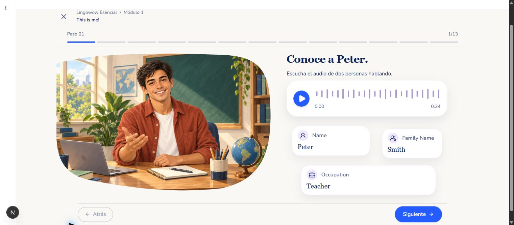
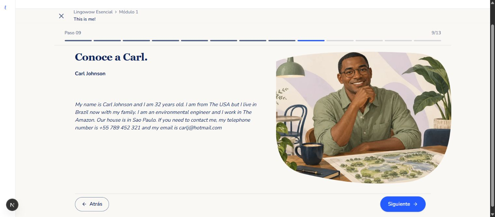

# Illustrated scene acceptance — unit 1

The rejected implementation used isolated portraits with CSS circles and lilac bands. This revision uses complete painted environments and keeps all teaching text, audio, fields, answers and recording controls in HTML.

## References and actual screens

Compare the classroom family in [scenes-ui.webp](scenes-ui.webp) and the large office composition in [the approved multimedia plate](../content-format-mockups/v3/04-multimedia.webp) with the actual local viewer screenshots:

Peter occupies the left scene with a classroom window, plants, chalkboard, books, desk, notebook and globe. Live audio and three facts occupy the right. Carl occupies the right office scene; the complete authored reading stays on the left. Lucas has a complete learning-room scene beside the To Be table and transformations. Practice and possessives use a complete sunlit study room. Writing uses a large notebook desk; speaking uses a large microphone and headphones desk.

The environments occupy a substantial part of the desktop composition: Peter's image is approximately 630 × 424 pixels in the normal 1520-pixel browser capture; the decorative setting spans 64% of the viewer shell. The image is decoration, not a clickable layer. There are no CSS wash/band substitutes. Organic masks crop the painted scene without turning controls into image content.

## Checked locally

- Reviewed the 13 authored steps in Chrome at desktop and 390 × 844 mobile sizing. Grouping, text, questions, audio URLs and recording limits remain unchanged.
- Corrected the narrowed grammar reference into a readable single column; all five table rows and all three sentence transformations remain available by scrolling.
- At 820 × 1180 tablet sizing, Peter and Carl stack below the content; the complete grammar transformations stay legible. Carl's page width and scroll width both measured 820px, with artwork bounds 96–724px.
- On mobile, controls precede a separate full-color environment. All scenes and footer controls remain reachable by scrolling; the recording scene was checked at the bottom of the page.
- Confirmed the two live audio players show their authored durations, 24 and 15 seconds. No answers, recordings or grading requests were submitted during visual review.
- The preview uses the actual saved authored dev unit data in the real viewer, with a minimal local navigation shell. It does not validate authentication, actual dev navigation or deployment.
- Chrome reported hydration differences caused by extension-injected `bis_skin_checked` attributes. This is recorded as an environment limitation; application hydration tests remain enabled.

## Differences from the reference plates

The reference plates cover several alternative content types; the actual unit contains 13 steps and no park or video block. This implementation preserves that authored sequence. Desktop illustrations are organically masked beside or behind live content; mobile stacks the scene below the activity rather than placing text over a busy painting. The combined grammar reference requires scrolling instead of compressing the table and transformation examples.

## Technical validation

The unit suite passed 145 files / 1059 tests. Lint and TypeScript passed locally. The scene-layer test was updated with explicit user approval: it now requires the real illustrated setting, broad coverage and pointer-free decoration. An additional test covers the environment portrait branch, organic clipping and pointer safety. No teaching behavior changed; the remaining edits are styling, illustration assets and documentation.

Generated artwork provenance and exact prompts: [runtime-scenes-v3.json](runtime-scenes-v3.json). Original cutouts are retained as versioned siblings; optimized runtime assets are WebP.
